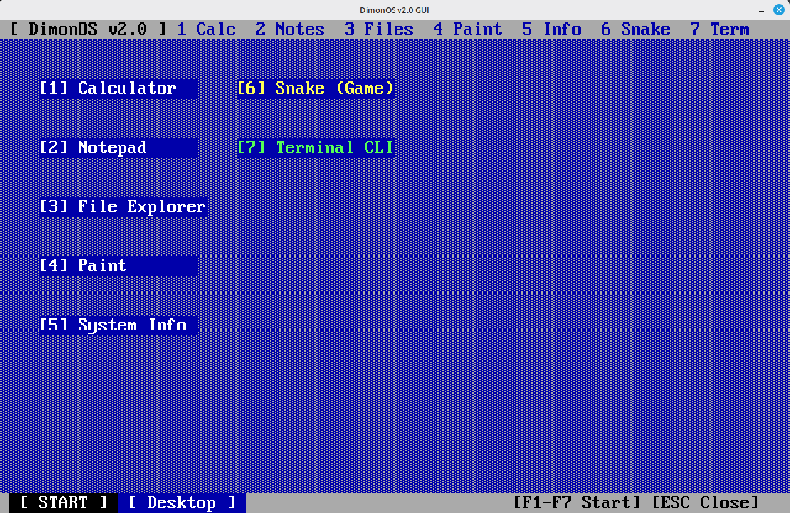
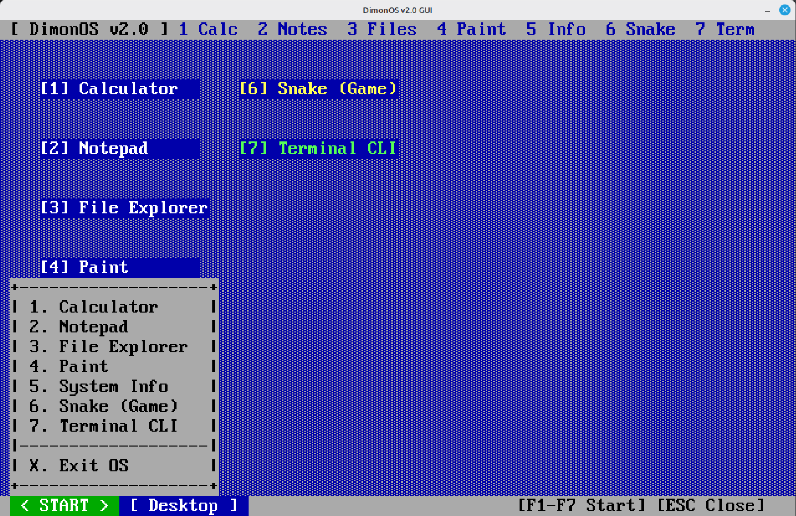
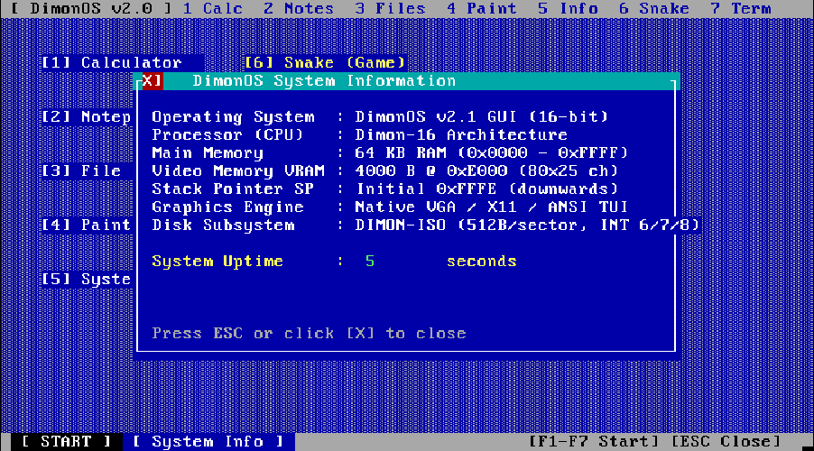
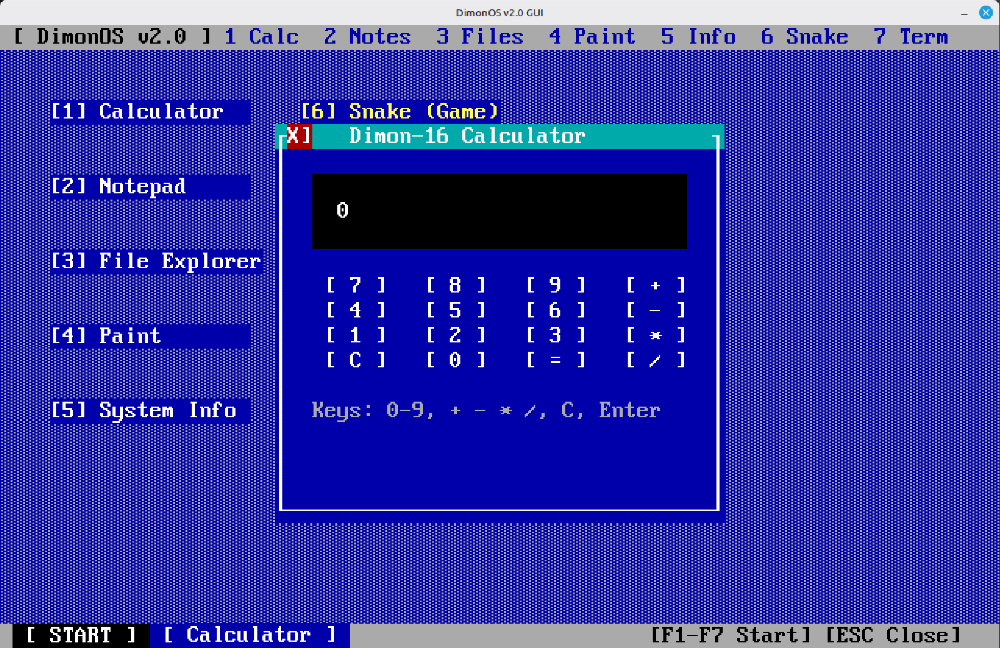
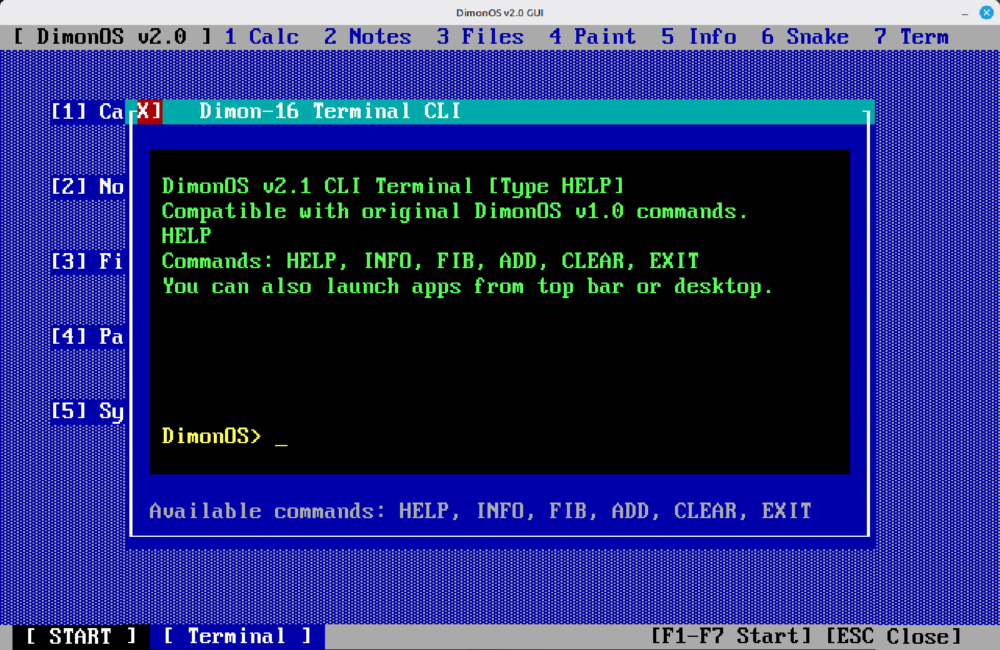
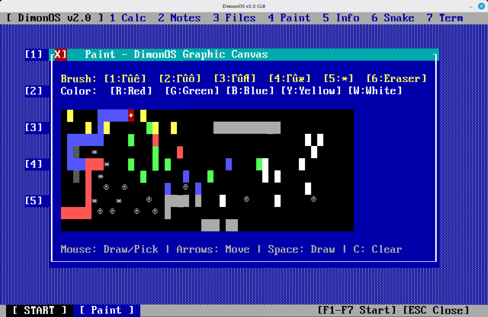

# Dimon-16 — 16-bit System & DimonOS v2.1 Native Bare-Metal GUI

An educational 16-bit computer system and operating system written in C and Assembly:
- **Dimon-16 Virtual Machine & Instruction Set**: 16-bit CISC CPU, 64 KB RAM, 8 registers, disk and GUI interrupts.
- **Modular Macro Assembler (`dimon-as`)**: Two-pass assembler with multi-file includes.
- **Dual-Backend Host Emulator (`dimon-emu`)**: Native X11 window (CP437 bitmap font) and raw ANSI terminal TUI with mouse tracking.
- **DimonOS v2.1 Operating System**: Full desktop environment, window manager, start menu, mouse/keyboard input, and 7 built-in applications.
- **Native Bare-Metal x86 Kernel (`dimon-baremetal.iso`)**: Multiboot 1 compliant standalone kernel running directly on physical x86 PC hardware or QEMU without any host Linux operating system.

---

## Dimon-16 Processor Architecture

<!--  -->
<p align="center">
  
  
</p>

| Component | Specification |
|---|---|
| Word Size | 16-bit |
| RAM | 64 KB (`0x0000`–`0xFFFF`) |
| VRAM | 4000 bytes at `0xE000`–`0xEFA0` (80×25 character-attribute cells, 2 bytes/cell) |
| Registers | `R0`–`R7` (16-bit general purpose), `PC`, `SP` (starts at `0xFFFE`, grows down) |
| Flags | `Z` (Zero), `C` (Carry / Borrow) |
| I/O & Traps | Instructions `IN R, port`, `OUT port, R` and syscall interrupts `INT n` |

### Instruction Set
- `MOV dst, src` — Copy (modes: `R`, `immediate`, `[addr]`, `[Rn]`)
- `ADD/SUB/MUL/DIV/AND/OR/XOR/CMP dst, src` — Arithmetic & logic (`CMP` sets flags)
- `NOT/INC/DEC/PUSH/POP dst`, `SHL/SHR dst, src`
- `JMP/JZ/JNZ/JC/JNC dst`, `CALL dst`, `RET`, `IRET`
- `LDB R, src` — Load byte (zero-extended); `STB dst, src` — Store byte
- `INT n` — System call, `HLT`, `NOP`

### System Calls Table (`INT n`)

| n | Mnemonic | Description |
|:---:|---|---|
| `0` | `PUTCHAR` | Print ASCII character from `R0` |
| `1` | `GETCHAR` | Read character from keyboard → `R0` |
| `2` | `PRINTSTR` | Print null-terminated string at address `R0` |
| `3` | `PRINTNUM` | Print `R0` as unsigned integer |
| `4` | `READNUM` | Read integer → `R0` (`C=0` success, `C=1` error) |
| `5` | `NEWLINE` | Print newline `\n` |
| `6` | `DISK_READ` | Read ISO sectors: `R0=LBA, R1=RAM, R2=count` → `C/R0` status |
| `7` | `DISK_INFO` | Query disk: `R0=sectors lo, R2=sectors hi, R1=512` bytes/sector |
| `8` | `DISK_WRITE` | Write sectors to disk (requires `--disk-writable`) |
| `10` | `SYS_GUI_INIT` | Init GUI: `R0=80 (width), R1=25 (height), R2=0xE000 (VRAM)` |
| `11` | `SYS_GUI_POLL_EVENT` | Non-blocking event poll: `R0=type, R1=code/X, R2=data/Y` |
| `12` | `SYS_GUI_FLUSH` | Flush VRAM to physical display (VGA / X11 / TUI) |
| `13` | `SYS_GET_TICKS` | Uptime in milliseconds: `R0=lo16, R1=hi16` |
| `14` | `SYS_GUI_DRAW_RECT` | Hardware rectangular fill: `R0=pos, R1=dim, R2=char\|attr` |
| `15` | `SYS_GUI_DRAW_TEXT` | Fast string rendering: `R0=pos, R1=str, R2=attr` |

---

## DimonOS v2.1 GUI

- **Desktop Shell**: IBM CP437 `░` background pattern, interactive desktop icons, top menu bar, bottom taskbar with interactive `[ START ]` button, and pop-up Start Menu.
- **Window Manager**: Framed movable windows with title bar, close button `[X]`, drop shadows, and automatic redraw management.
- **Input Subsystem**: Full mouse support (buttons, movement) and keyboard shortcuts (F1–F7, 1–7, arrow keys, ESC).
- **Instant Display on Startup**: GUI/VRAM is immediately flushed and rendered upon startup with no black screen and no initial input needed.

### 7 Built-in Applications:
1. **Calculator** (`F1` / `1`): 16-bit arithmetic calculator with interactive mouse keypad.
2. **Notepad** (`F2` / `2`): Text editor with editing cursor, clear (`F8`), save to ISO disk (`F9`), and load from ISO disk (`F10`).
3. **ISO File Explorer** (`F3` / `3`): Two-panel directory browser with real-time text file preview from disk.
4. **Paint** (`F4` / `4`): 48×10 drawing canvas, 6 brush tools (`█`, `▓`, `▒`, `░`, `*`, `Eraser`), 5 colors, mouse/keyboard painting.
5. **System Info** (`F5` / `5`): Hardware parameters and real-time millisecond/second uptime counter.
6. **Snake (Game)** (`F6` / `6`): Timer-driven arcade game with food generation, collision detection, and high score tracking.
7. **Terminal CLI** (`F7` / `7`): Command prompt shell with history scrollback and commands: `help`, `info`, `add`, `fib`, `clear`, `exit`.

---

## Native Bare-Metal Execution (x86 PC & QEMU)

DimonOS includes a freestanding 32-bit Multiboot x86 native kernel (`arch/x86/`):
- **Bootloader**: Multiboot 1 compliant, loads via GRUB, iPXE, or QEMU direct kernel boot.
- **VGA Text Driver**: Directly maps Dimon-16 VRAM to physical VGA memory at `0x000B8000` (80×25 cells, CP437 font, 16 colors).
- **Hardware Drivers**: 8259 PIC interrupt remapping, 8254 PIT 1000 Hz timer, PS/2 Keyboard controller with Scancode Set 1 decoding, PS/2 Mouse driver with hardware cursor, and COM1 serial output.
- **Embedded Storage**: Embeds `os.bin` and virtual `dimon.iso` disk volumes directly into kernel images.

### Quick Start: Running in QEMU on Linux
```bash
# Build kernel and bootable ISO
make baremetal-iso

# Boot ISO in QEMU
make qemu

# Or boot directly with QEMU:
qemu-system-i386 -cdrom dimon-baremetal.iso
```
### Quick Start: Running in QEMU on Windows 11
```
& "C:\Program Files\qemu\qemu-system-i386.exe" -cdrom dimon-baremetal.iso
```

### Running on Real Hardware (USB Drive)
Flash the hybrid ISO directly to a USB flash drive (replace `/dev/sdX` with your USB device):
```bash
sudo dd if=dimon-baremetal.iso of=/dev/sdX bs=4M status=progress conv=fsync
```
Reboot your physical computer and select the USB drive from the BIOS/UEFI boot menu.

---

## Host Emulator Execution (`dimon-emu`)

For host-based development and debugging on Linux:

```bash
# 1. Native X11 graphics window
./dimon-emu os.bin

# 2. X11 with 2x scaling (1280x800)
./dimon-emu --scale 2 os.bin

# 3. ANSI TUI terminal mode (works over SSH and headless servers)
./dimon-emu --tui os.bin

# 4. Attach ISO disk volume
./dimon-emu --gui os.bin --iso dimon.iso
```

---

## Documentation (`docs/`)

- [docs/01_gui_architecture.md](file:///home/programista/Pulpit/Dimon/docs/01_gui_architecture.md) — VRAM specifications, cell layout, color palette, and GUI system calls.
- [docs/02_operating_system.md](file:///home/programista/Pulpit/Dimon/docs/02_operating_system.md) — Kernel lifecycle, memory layout, event loop, and window manager.
- [docs/03_applications.md](file:///home/programista/Pulpit/Dimon/docs/03_applications.md) — Architecture and controls for all 7 applications.
- [docs/04_user_manual.md](file:///home/programista/Pulpit/Dimon/docs/04_user_manual.md) — Build prerequisites, CLI flags, keybindings, and troubleshooting.
- [docs/CHANGELOG.md](file:///home/programista/Pulpit/Dimon/docs/CHANGELOG.md) — Complete release history and changes.

---

## Build Targets

```bash
make all           # Build host tools (dimon-as, dimon-emu, dimon-mkiso)
make progs         # Assemble DimonOS v2.0 (os.bin) and all examples
make iso           # Build DIMON-ISO virtual disk image (dimon.iso)
make baremetal-iso # Build standalone bootable ISO (dimon-baremetal.iso)
make qemu          # Run baremetal ISO in QEMU
make test          # Run automated unit and CLI tests
make gui-test      # Run automated headless TUI GUI test
make clean         # Clean all build artifacts
```

## Screenshots
| | | |
| :---: | :---: | :---: |
|  |  |  |
|  |  |  | 


