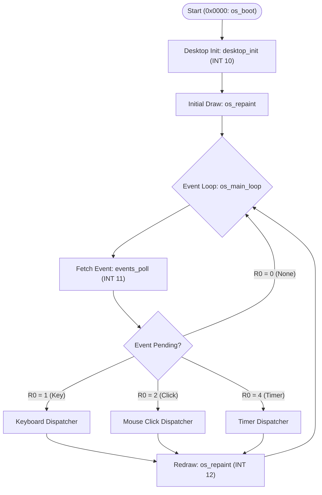
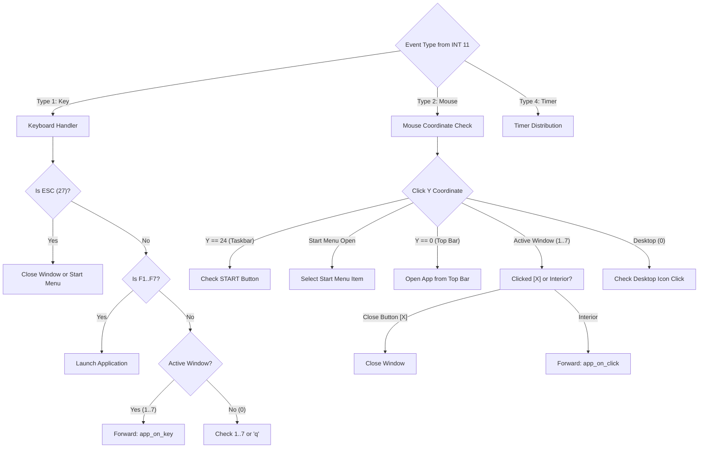

# 02. DimonOS v2.0 GUI Operating System

This document provides a detailed description of the architecture, memory layout, system lifecycle, and window manager of the **DimonOS v2.0** operating system designed for the **Dimon-16** architecture.

---

## 1. Introduction and Design Goals

DimonOS v2.0 is a 16-bit graphical operating system. It was designed to provide:
1. **Full Graphical Desktop Environment**: Desktop icons, top menu bar, bottom taskbar, pop-up Start menu, and draggable/movable window frames.
2. **Comprehensive Mouse and Keyboard Input**: Full system usability via mouse alone (clicking menus, icons, calculator buttons, canvas drawing, file selection) or keyboard alone (F1–F10 shortcuts, 1–7 numeric keys, arrows, Enter, ESC).
3. **Event-Driven Cooperative Architecture**: The kernel does not block the CPU, but dispatches incoming events (keys, mouse clicks, timer ticks) in an `events_poll` loop.
4. **Strict 16-Bit Memory Constraints**: The entire OS fits within 64 KB of RAM, organizing code, buffers, stack, and VRAM cleanly.

---

## 2. RAM Organization (Memory Layout)

The Dimon-16 architecture provides a 64 KB flat address space (`0x0000` to `0xFFFF`). In DimonOS v2.0, memory is partitioned as follows:

```
+------------------+ 0xFFFF
| Stack            | SP starts at 0xFFFE and grows downward
+------------------+ 0xEFA0
| VRAM (4000 B)    | 80 columns x 25 rows x 2 bytes (char + attribute)
+------------------+ 0xE000
| Free User RAM    | Available for user programs & dynamic data
+------------------+ ~0x4000
| OS Data Buffers  | Notepad buffer (512 B), ISO catalog buffer (512 B),
| & App State      | Paint canvas (960 B), Terminal history (400 B)
+------------------+ ~0x0000 - 0x3FFF
| Machine Code     | Kernel, GUI routines, window manager,
| DimonOS v2.0     | event handling, 7 built-in applications
+------------------+ 0x0000
```

### Application Buffer Allocation:
- `note_buf` (`512 bytes`): Holds currently edited Notepad document (up to 500 characters + newline and null terminator).
- `fm_cat_buf` (`512 bytes`): Buffer for 1 sector of the ISO disk directory catalog.
- `fm_preview_buf` (`512 bytes`): Buffer for file preview data loaded from disk.
- `paint_canvas_chars` (`480 bytes`): Character codes for 48×10 drawing canvas.
- `paint_canvas_attrs` (`480 bytes`): Color attribute codes for 48×10 drawing canvas.
- `snake_x` / `snake_y` (`64 bytes each`): Coordinates for Snake body segments.
- `term_lines` (`400 bytes`): Terminal CLI scrollback history buffer (8 lines of 50 bytes each).

---

## 3. System Lifecycle and Event Loop

The operating system boots at address `0x0000` under the label `os_boot` in [os.asm](file:///home/programista/Pulpit/Dimon/os.asm).



### Startup Sequence:
1. **`os_boot`**: Calls `desktop_init`, which triggers `INT 10` (`SYS_GUI_INIT`) to activate the display backend. It initializes core state variables (`start_menu_open = 0`, `active_window = 0`).
2. **`os_repaint`**:
   - Draws desktop pattern background, icons, top bar, and bottom taskbar (`desktop_draw`).
   - If an application window is open (`active_window` between 1 and 7), calls the application's draw routine (e.g. `calc_draw`, `paint_draw`).
   - Calls `INT 12` (`SYS_GUI_FLUSH`) to immediately flush VRAM to the screen.
3. **`events_poll`**: Calls non-blocking `INT 11`. If an event is present, it is dispatched according to event type.

---

## 4. Window Manager

Implemented in [gui/window.asm](file:///home/programista/Pulpit/Dimon/gui/window.asm), the window manager handles window state, switching, and framing.

### Active Window Registry (`active_window`):
| Value | Meaning |
|:---:|---|
| `0` | **Desktop** (No active window) |
| `1` | **Calculator** |
| `2` | **Notepad** |
| `3` | **ISO File Explorer** |
| `4` | **Paint** |
| `5` | **System Info** |
| `6` | **Snake (Game)** |
| `7` | **Terminal CLI** |

### Core Procedures:
- **`window_open(R0)`**:
  - Sets `active_window = R0`.
  - Closes Start menu (`start_menu_open = 0`).
  - Calls application init procedure (`calc_init`, `notepad_init`, etc.).
  - Triggers a full redraw (`os_repaint`).
- **`window_close()`**:
  - Sets `active_window = 0`.
  - Triggers desktop redraw.
- **`draw_window_frame(R0, R1, R2)`**:
  - `R0` = Coordinates `X | (Y << 8)`
  - `R1` = Dimensions `W | (H << 8)`
  - `R2` = String pointer to window title
  - Fills window interior.
  - Draws title bar in white on cyan (`0x3F`).
  - Places bright red close button `[X]` (`0x4F`) on the left of the title bar.
  - Draws CP437 box-drawing frame: corners `┌` (`0xDA`), `┐` (`0xBF`), `└` (`0xC0`), `┘` (`0xD9`), horizontal `─` (`0xC4`), vertical `│` (`0xB3`).

---

## 5. Desktop Shell Components

The desktop shell ([gui/desktop.asm](file:///home/programista/Pulpit/Dimon/gui/desktop.asm)) provides:

### 1. Top Menu Bar (Row 0, Height 1)
- Style: Black text on light gray (`0x70`).
- Displays branding: `[ DimonOS v2.0 ] 1 Calc  2 Notes  3 Files  4 Paint  5 Info  6 Snake  7 Term`.
- Clicking any item directly launches the application.

### 2. Desktop Background (Rows 1–23, Columns 0–79)
- Filled with CP437 pattern `░` (`0xB0`) in dark blue (`0x17`).

### 3. Desktop Icons
Arranged in two left-hand columns:
- **Column 1 (X = 4)**:
  - `[1] Calculator  ` (Row 3)
  - `[2] Notepad     ` (Row 6)
  - `[3] File Explorer` (Row 9)
  - `[4] Paint       ` (Row 12)
  - `[5] System Info ` (Row 15)
- **Column 2 (X = 24)**:
  - `[6] Snake (Game)` (Row 3)
  - `[7] Terminal CLI` (Row 6)

Each icon is interactive via mouse click or pressing numeric keys `1`–`7` on the desktop.

### 4. Bottom Taskbar (Row 24, Height 1)
- Light gray background (`0x70`).
- **START Button**:
  - Columns `X = 1..10`.
  - Idle state: ` [ START ] ` (color `0x0F` - white on black).
  - Open state: ` < START > ` (color `0x2F` - highlighted).
  - Toggles the Start Menu.
- **Active Task Button**:
  - Columns `X = 12..30`.
  - When windows are closed, displays ` [ Desktop ] `.
  - When an application is open, displays its title (e.g. ` [ Calculator ] `, ` [ Notepad ] `).
- **Shortcuts Hint**:
  - Columns `X = 52..79`.
  - Displays: `[F1-F7 Start] [ESC Close]`.

### 5. Start Menu (Pop-up Window)
- Geometry: `X = 1..21`, `Y = 13..23` (11 rows high, 21 columns wide).
- Lists applications 1 through 7, a horizontal divider, and `X. Exit OS` (`HLT`).

---

## 6. Input Subsystem and Event Dispatching

[gui/events.asm](file:///home/programista/Pulpit/Dimon/gui/events.asm) handles events from `INT 11` hierarchically:


